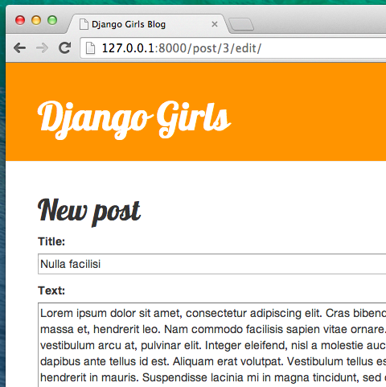

# Djangoフォーム

私たちのWebサイトで最終的にやりたいことは、投稿を追加したり編集したりするためのよい方法を作ることです。 `Django admin`はかなりいいですが、カスタマイズしたりかわいくいい感じにするのはちょっと大変です。 `フォーム` によってインターフェイスを完璧にコントロールできるようになります。想像するほとんど全てのことができます！

Djangoフォームのよいところは、フォームをゼロから定義できたり、フォームの結果をモデルに保存できる`ModelForm`を作れたりするところです。

これはまさに私たちがやりたいことです：`Post`モデルのためのフォームを作ります。

Djangoの他の重要なパーツと同様に、フォームは自身のファイルがあります: `forms.py`

これは`blog`ディレクトリの下にforms.pyの名前で作る必要があります。

    blog
       └── forms.py
    

このファイルをエディタで開き、次のコードを入力してください。

blog/forms.py

```python
from django import forms

from .models import Post

class PostForm(forms.ModelForm):

    class Meta:
        model = Post
        fields = ('title', 'text',)
```

最初にDjangoのformsをインポート（`from django import forms`）し、`Post`モデルもインポート（`from .models import Post`）する必要があります。

`PostForm`とは何かと思うかもしれませんが、これはフォームの名前です。 このフォームが `ModelForm` の一種だとDjangoに伝える必要があります (Djangoが私たちのためにいくつか魔法をかけられるように)。`forms.ModelForm`がその役割を果たします。

次に`class Meta`ですが、ここでDjangoにフォームを作るときにどのモデルを使えばいいか (`model = Post`) を伝えます。

最後にフォームのフィールドに何を置くか書きます。 今回は、私たちは`title`（タイトル）と `text`（本文）のみをフォームで使用します。 `author` は現在ログインしている人（あなた）です。 `created_date` は（コードによって）自動的に投稿を作った日時が設定されます。

ひとまずこれでおしまいです！あとはフォームを*ビュー*で使い、それをテンプレート内に表示しさえすればいいです。

もう一度、ページへのリンク、URL、ビューとテンプレートを作ります。

## フォームにおけるページへのリンク

リンクを追加する前に、いくつかのアイコンをリンクのボタンとして使用する必要があります。 このチュートリアルでは、 [file-earmark-plus.svg](https://raw.githubusercontent.com/twbs/icons/main/icons/file-earmark-plus.svg) をダウンロードし、 `blog/templates/blog/icons/` に保存してください。

> 注意: SVG 画像をダウンロードするには、リンク上のコンテキストメニュー(通常は右クリックして)を開き、「名前を付けてリンクを保存」を選択します。 ファイルを保存する場所を尋ねるダイアログでは、Djangoプロジェクトの `djangogirls` ディレクトリに移動し、その中のサブディレクトリ `blog/templates/blog/icons/` に移動して、そこにファイルを保存します。

`blog/templates/blog/base.html` をエディタで開きましょう。 これで基本テンプレート内のアイコンファイルを以下のように使用できます。 `header` セクション内の `div` 要素では、`h1` 要素の前にリンクを追加します。

blog/templates/blog/base.html

```html
<a href="" class="top-menu">
    
</a>
```

`post_new`という新しいビューを作ります。 SVGアイコン [](https://icons.getbootstrap.com/icons/file-earmark-plus/) は [ブートストラップアイコン](https://icons.getbootstrap.com/) によって提供され、プラス記号のページアイコンが表示されます。 Djangoテンプレートディレクティブの `include` を使います。 これにより、Djangoテンプレートにファイルの内容が挿入されます。 ウェブブラウザは、この種のコンテンツを処理する方法を知っているので、これ以上の処理は必要ありません。

> ブートストラップアイコンは [こちら](https://github.com/twbs/icons/releases/download/v1.1.0/bootstrap-icons-1.1.0.zip)からダウンロードできます。 ファイルを解凍し、すべてのSVG画像ファイルを `blog/templates/blog/` の中の `icon` という新しいフォルダにコピーします。 これにより、`blog/templates/blog/icons/pencil-fill.svg` というファイルパスで `pencil-fill.svg` のようなアイコンにアクセスすることができます。

行を追加すると、このような html ファイルになります。

blog/templates/blog/base.html

```html

<!DOCTYPE html>
<html>
    <head>
        <title>Django Girls blog</title>
        <link rel="stylesheet" href="https://cdn.jsdelivr.net/npm/bootstrap@5.1.3/dist/css/bootstrap.min.css" integrity="sha384-1BmE4kWBq78iYhFldvKuhfTAU6auU8tT94WrHftjDbrCEXSU1oBoqyl2QvZ6jIW3" crossorigin="anonymous">
        <link href='//fonts.googleapis.com/css?family=Lobster&subset=latin,latin-ext' rel='stylesheet' type='text/css'>
        <link rel="stylesheet" href="">
    </head>
    <body>
        <header class="page-header">
            <div class="container">
                <a href="" class="top-menu">
                    
                </a>
                <h1><a href="/">Django Girls Blog</a></h1>
            </div>
        </header>
        <main class="content container">
            <div class="row">
                <div class="col">
                    
                    
                </div>
            </div>
        </main>
    </body>
</html>
```

ファイルを保存して、ページ http://127.0.0.1:8000 をリロードすると見覚えのある `NoReverseMatch` エラーが表示されると思います。実際にそうなってますか？いいですね！

## URL

`blog/urls.py`をエディタで開き、次の行を追加します。

blog/urls.py

```python
path('post/new/', views.post_new, name='post_new'),
```

次に、このような内容を追加します。

blog/urls.py

```python
from django.urls import path 
from . import views

urlpatterns = [
    path('', views.post_list, name='post_list'),
    path('post/<int:pk>/', views.post_detail, name='post_detail'),
    path('post/new/', views.post_new, name='post_new'),
]
```

サイトをリロードした後、`AttributeError`が出ます。`post_new`ビューの実装がないからです。ファイルに追加してみましょう。

## post_new ビュー

`blog/views.py`をエディタで開き、`from`の行の後に次の内容を追加してみましょう。

blog/views.py

```python
from .forms import PostForm
```

その後に*ビュー*を追加します。

blog/views.py

```python
def post_new(request):
    form = PostForm()
    return render(request, 'blog/post_edit.html', {'form': form})
```

新しい `Post` フォームを作成するには、 `PostForm()` を呼び出してテンプレートに渡す必要があります。 あとでこの *ビュー* に戻ってきますが、今はフォームのためのテンプレートをすぐに作ってしまいましょう。

## テンプレート

`blog/templates/blog` ディレクトリに `post_edit.html` ファイルを作成し、それをコード エディターで開きます。 フォームを動かすにはいくつかやることがあります。

* フォームを表示する必要があります。 私たちは（例えば）`{{ form.as_p }}` でこれを行うことができます。
* 上記の行は HTMLのformタグでラップする必要があります：`<form method="POST">...</form>`
* `Save` ボタンが必要です。これをHTMLのbuttonタグで行います：`<button type="submit">Save</button>`
* 最後に`<form ...>` タグの開始直後に、 ``を追加する必要があります。 フォームをセキュアにするためこれは非常に重要です！ これを忘れると、Djangoはフォームを保存しようとすると文句を言うでしょう：


では、 `post_edit.html` の HTML がどのように見えるか見てみましょう。

blog/templates/blog/post_edit.html

```html



    <h2>New post</h2>
    <form method="POST" class="post-form">
        {{ form.as_p }}
        <button type="submit" class="save btn btn-secondary">Save</button>
    </form>

```

更新をしてみましょう。やった！フォームが表示されます。


ちょっと待ってみて下さい。`title` と `text` フィールドに何か入力して保存するとどうなりますか？

何も起きません！もう一度同じページに戻りテキストはどこかに行ってしまいました… そして新しい投稿は追加されていません。何がいけなかったのでしょうか？

答えは: 何も間違ってない、です。*ビュー* でもう少し作業を行う必要があります.

## フォームを保存する

`blog/views.py` をもう一度エディタで開きます。現在の `post_new` ビューはこうなっています。

blog/views.py

```python
def post_new(request):
    form = PostForm()
    return render(request, 'blog/post_edit.html', {'form': form})
```

フォームを送信すると、同じビューに戻ります。ただ、今回は `request` にいくつかのデータを足していきます。具体的には `request.POST` です。（ここでいう「POST」はブログの投稿を表す「post」とは関係ありません。「このデータは送られてきたもの」という意味で使われています）。 HTMLファイルの `<form>` タグで、`method="POST"` という変数があったのを覚えていますか？ フォームのすべてのフィールドが `request.POST` に入っています。 `POST` という名前を何か別のものに変えることはできません (他に唯一の有効な `method` の値は `GET` ですが、その違いを説明する時間がありません) 。

私たちの *ビュー* では、扱わなくてはならない２つの別々のシチュエーションがあります: １つ目は、最初にページにアクセスしてきた時で空白のフォームが必要な場合。２つ目はすべてのフォームデータが入力された状態で*ビュー*に戻ってくる場合です。 したがって条件分岐を追加する必要があります（そのために`if`を使います）。それでは[...]の部分を埋めていきます。

blog/views.py

```python
if request.method == "POST":
    [...]
else:
    form = PostForm()
```

`[...]` の部分を埋めていきましょう。 `method`が`POST`の場合、フォームのデータを使って`PostForm`を構築します。 以下のようにします。

blog/views.py

```python
form = PostForm(request.POST)
```

次にフォームの値が正しいかどうかをチェックします（すべての必須フィールドが設定され、不正な値が送信されないこと）。 `form.is_valid()` で行います。

フォームをチェックして、フォームの値が有効であれば保存できます。

blog/views.py

```python
if form.is_valid():
    post = form.save(commit=False)
    post.author = request.user
    post.published_date = timezone.now()
    post.save()
```

基本的にここでは2つのことを行います。まず `form.save` でフォームを保存することと author を追加することです (`PostForm` 内に `author` フィールドがありませんし、このフィールドは必須です) 。 `commit=False` は、`Post` モデルをまだ保存したくない、まず author を追加したいという意味です。 ほとんどの場合、 `commit=False` を指定せずに `form.save()`を使用しますが、この場合はそれを指定する必要があります。 `post.save()` はauthor を追加しつつ変更を保存し、新しいブログ投稿が作成されます！

最後に、新しく作成された投稿の `post_detail` ページを表示できれば良いですよね? そのために次のインポートを追加します:

blog/views.py

```python
from django.shortcuts import redirect
```

これをファイルの先頭に追加します。これでようやく、新しく作成されたポストのための `post_detail` ページに移動する処理を書けます。

blog/views.py

```python
return redirect('post_detail', pk=post.pk)
```

`post_detail` は移動したいビューの名前です。 この *ビュー* では `pk` 変数が必須であることを覚えていますか? ビューにそれを渡すため、`pk=post.pk`を使います。この `post` は新しく作られたブログの投稿です！

OK, たくさんのことを説明しました。全体の view は以下のようになります。

blog/views.py

```python
def post_new(request):
    if request.method == "POST":
        form = PostForm(request.POST)
        if form.is_valid():
            post = form.save(commit=False)
            post.author = request.user
            post.published_date = timezone.now()
            post.save()
            return redirect('post_detail', pk=post.pk)
    else:
        form = PostForm()
    return render(request, 'blog/post_edit.html', {'form': form})
```

うまくいくかどうか見てみましょう。 http://127.0.0.1:8000/post/new/ に行き、 `title` と `text` を追加し、保存すると…… じゃじゃーん！ 新しいブログ投稿が追加され、 `post_detail` ページにリダイレクトされます！

投稿を保存する前に公開日を設定していることに気づいたかもしれません。 後で、 **Django Girls Tutorial: Extensions** にて *publish button* を紹介します。

素晴らしい！

> Django adminを使ってきたので、システム上で今まだログイン状態かと思います。 いくつかの状況ではログアウト状態になることがあります(ブラウザを閉じる、DBを再起動するなど..)。 投稿を作成するときに、ログインユーザーがわからないというエラーが発生した場合は、管理ページhttp://127.0.0.1:8000/admin にアクセスして再度ログインしてください。 これは一時的に問題を解決します。 メインチュートリアルの後 **Homework: add security to your website!** の章に恒久的な対策がありますので宿題として取り組んでみてください。


## フォームのバリデーション(検証)

ここで、Djangoのフォームがいかにクールかをお見せします。 ブログの投稿は `title` と `text` のフィールドが必要です。 Post モデルでは、これらのフィールドがなくてもよいとは書いておらず(デフォルトの値が設定されている published_date とは対照的に)、Djangoではその場合、それらのフィールドには何らかの値が設定されないとエラーが起こるようになっています。

`title` と `text` を入力せずに保存してみましょう。何が起こるでしょうか?


Djangoはフォームのすべてのフィールドが正しいことを検証してくれます。気が利くでしょう?

## フォームの編集

今や、私たちはどのように新しい投稿を追加するか知っています。 しかし、既存のものを編集したい場合はどうでしょうか? それは先ほど行ったことと非常に似ています。 すぐに重要なものを作成してみましょう。 (わからないことがあれば、コーチに聞くか、前の章を見てください。これらのステップはすでにすべてカバーしていますので)

まず、編集ボタンを表すアイコンを保存しましょう。 [pencil-fill.svg](https://raw.githubusercontent.com/twbs/icons/main/icons/pencil-fill.svg) をダウンロードし、 `blog/templates/blog/icons/` に保存します。

`blog/templates/blog/post_detail.html` をコードエディタで開き、 `article` 要素内に次のコードを追加します。

blog/templates/blog/post_detail.html

```html
<aside class="actions">
    <a class="btn btn-secondary" href="">
      
    </a>
</aside>
```

テンプレートは次のようになります:

blog/templates/blog/post_detail.html

```html



    <article class="post">
        <aside class="actions">
            <a class="btn btn-secondary" href="">
                
            </a>
        </aside>
        
            <time class="date">
                {{ post.published_date }}
            </time>
        
        <h2>{{ post.title }}</h2>
        <p>{{ post.text|linebreaksbr }}</p>
    </article>

```

`blog/urls.py`をエディタで開き、次の行を追加します。

blog/urls.py

```python
    path('post/<int:pk>/edit/', views.post_edit, name='post_edit'),
```

テンプレート `blog/templates/blog/post_edit.html` を再利用します。そして残るは*ビュー*です。

`blog/views.py` をエディタで開いて次の内容をファイルの最後に追加します：

blog/views.py

```python
def post_edit(request, pk):
    post = get_object_or_404(Post, pk=pk)
    if request.method == "POST":
        form = PostForm(request.POST, instance=post)
        if form.is_valid():
            post = form.save(commit=False)
            post.author = request.user
            post.published_date = timezone.now()
            post.save()
            return redirect('post_detail', pk=post.pk)
    else:
        form = PostForm(instance=post)
    return render(request, 'blog/post_edit.html', {'form': form})
```

`post_new` とほとんど同じに見えますか? しかし完全に同じではありません。 まず `urls` から追加の `pk` パラメータを渡します。 次に編集したい`Post` モデルを `get_object_or_404(Post, pk=pk)` で取得し、フォームを作るときは以下の2つのケースのように、その投稿を `instance` として渡します。フォームを保存するときにも…

blog/views.py

```python
form = PostForm(request.POST, instance=post)
```

…そしてこの投稿を編集するためにフォームを開いたときもそうです。

blog/views.py

```python
form = PostForm(instance=post)
```

よし、ちゃんと動くか試してみましょう！`post_detail` ページにいきましょう。そこの右上に [編集] ボタンがあるはずです：


クリックするとブログ投稿のフォームが表示されると思います：



あとは気軽にタイトルやテキストを変更して保存してください！

おめでとう！アプリケーションが完成しました。

If you need more information about Django forms, you should read the documentation: https://docs.djangoproject.com/en/3.2/topics/forms/

## セキュリティ

リンクをクリックするだけで新しい投稿を作成できることは素晴らしいことです！ しかし、今、あなたのサイトにアクセスした人は誰でも新しいブログ投稿を作成することができます。それはおそらくあなたが望むものではありません。 ボタンはあなたのためには表示されますが、他の人には表示されないようにしましょう。

`blog/templates/blog/base.html` をエディタで開き、`page-header` と名付けた `div` と、そこに以前に入力したアンカータグを見つけます。 これは次のようになっています。

blog/templates/blog/base.html

```html
<a href="" class="top-menu">
    
</a>
```

これに別の `` タグを追加します。 このリンクは、管理者にログインしているユーザーのみ表示されます。 今、それはあなただけです! `<a>` タグを以下のように変更します：

blog/templates/blog/base.html

```html

    <a href="" class="top-menu">
        
    </a>

```

この `` は、ページをリクエストするユーザーがログインしている場合にのみ、リンクをブラウザに送信します。 これは、新しい投稿の作成を完全に保護するものではありませんが、それは良い第一歩です。 エクステンションレッスンでは、より多くのセキュリティをカバーします。

詳細ページに追加した編集アイコンを覚えていますか？ 他の人が既存の投稿を編集できないように、同じ変更を追加したいと思います。

`blog/templates/blog/post_detail.html` をエディタで開いて、次の行を見つけてください：

blog/templates/blog/post_detail.html

```html
<a class="btn btn-secondary" href="">
    
</a>
```

以下のように変更してください：

blog/templates/blog/post_detail.html

```html

     <a class="btn btn-secondary" href="">
        
     </a>

```

あなたはログインしている可能性が高いので、ページを更新しても、何も変わらないかもしれません。 ただし、別のブラウザやシークレットウィンドウ（Windows Edgeでは「InPrivate」と呼ばれます）でページを読み込むと、リンクが表示されず、アイコンも表示されないでしょう！

## もう一つ: デプロイの時間です!

ではPythonAnywhere上で動作するかを確認しましょう。再度デプロイします。

* まず、Githubにあなたの新しく書いたコードをCommitして、Pushしてみましょう。

command-line

    $ git status
    $ git add .
    $ git status
    $ git commit -m "Added views to create/edit blog post inside the site."
    $ git push
    

* それから、[PythonAnywhereのbashコンソール](https://www.pythonanywhere.com/consoles/)で：

PythonAnywhere command-line

    $ cd ~/<your-pythonanywhere-domain>.pythonanywhere.com
    $ git pull
    [...]
    

（忘れずに `<your-pythonanywhere-domain>` を自分のPythonAnywhereのサブドメイン名に置き換えましょう、<> は不要です。）

* 最後に、[Webページ](https://www.pythonanywhere.com/web_app_setup/) に飛んで（コンソールの右上のメニューボタンを使ってもいいですね）それから **Reload** を押しましょう。 変更を見るためにあなたのブログ https://subdomain.pythonanywhere.com を再読み込みしましょう。

うまくいってるはずです！おめでとうございます! :)