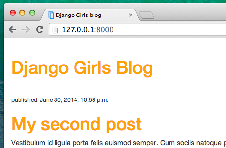
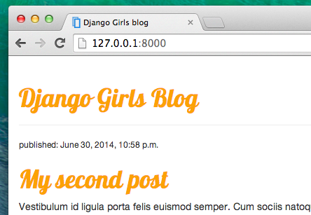

# CSS - зроби це красиво!

Наш блог все ще виглядає доволі жахливо, чи не так? Час зробити його гарним! Для цього будемо використовувати CSS.

## Що таке CSS?

Каскадні таблиці стилів (CSS) - це мова, яка використовується для опису вигляду та форматування веб-сайту, написаного на мові розмітки (наприклад, HTML). Розгляньте це як макіяж для нашої веб-сторінки. ;) 

Але ми не хочемо починати з нуля, чи не так? Ще раз повторюємо: ми будемо використовувати те, що програмісти випускають в Інтернеті безкоштовно. Ви знаєте, що винаходити велосипед не весело.

## Скористаємось Bootstrap!

Bootstrap - це один з найпопулярніших HTML-і CSS фреймворків для розробки гарних веб-сайтів: https://getbootstrap.com/

Цей фреймворк був написаний програмістами, які працювали у Twitter. Тепер він розробляється волонтерами з усього світу!

## Встановлюємо Boostrap

Для встановлення Bootstrap, відкрийте файл `.html` у редакторі коду і додайте наступний код в секцію `<head>`»:

blog/templates/blog/post_list.html

```html
<link rel="stylesheet" href="https://cdn.jsdelivr.net/npm/bootstrap@5.1.3/dist/css/bootstrap.min.css" integrity="sha384-1BmE4kWBq78iYhFldvKuhfTAU6auU8tT94WrHftjDbrCEXSU1oBoqyl2QvZ6jIW3" crossorigin="anonymous">
```

Це не додасть жодного файлу до вашого проекту. Натомість ці рядки просто вказують на файли опубліковані в інтернеті. Отже далі просто, відкрийте свій веб-сайт і оновіть сторінку. Ось так!


Виглядає набагато краще!

## Статичні файли в Django

Нарешті, ми детальніше розглянемо те, що ми називали **статичними файлами**. Статичні файли - це всі ваші CSS файли та зображення. Їх зміст не залежить від контексту запиту і буде однаковим для кожного користувача.

### Де помістити статичні файли для Django

Як ви бачили, коли ми запускали collectstatic на сервері, Django вже знає, де знайти статичні файли для вбудованого додатку "admin". Тепер нам просто потрібно додати деякі статичні файли для нашого власного додатку, `blog`.

Створимо директорію з ім’ям `static` всередині додатку blog:

    djangogirls
    ├── blog
    │   ├── migrations
    │   ├── static
    │   └── templates
    └── mysite
    

Django автоматично знайде всі папки, які називаються "статичними", в папках з будь-якими вашими додатками, і він буде мати можливість використовувати їх вміст як статичні файли.

## Ваш перший CSS файл!

Що ж, тепер створімо CSS файл для того, щоб додати ваш власний стиль до вашої вебсторінки. Створіть нову папку з назвою `css` всередині вашої папки `static`. Потім всередині папки `css` створіть новий файл з назвою `blog.css`. Готові?

    djangogirls
    └─── blog
         └─── static
              └─── css
                   └─── blog.css
    

Настав час написати CSS! Відкрийте файл `static/css/blog.css` в вашому редакторі коду.

Ми не будемо занурюватись тут надто глибоко в процес налаштування і вивчення CSS. Ми рекомендуємо безкоштовний CSS-курс в кінці цієї сторінки, якщо ви бажаєте вивчити більше.

Але давайте зробимо хоча б трохи. Можливо, ми могли б змінити колір заголовків? Щоб зрозуміти кольори, комп'ютери використовують спеціальні коди. Ці коди починаються з `#` та складаються з шести літер (A-F) та цифр (0-9). Наприклад, код синього кольору `#0000FF`. Ви можете знайти інші коди тут: http://www.colorpicker.com/. Також можете користуватися вже [визначеними кольорами ](http://www.w3schools.com/colors/colors_names.asp), такими як `red` та `green`.

У вашому файлі `static/css/blog.css` потрібно додати наступний код:

blog/static/css/blog.css

```css
h1 a, h2 a {
    color: #C25100;
}

```

`h1 a` - це CSS селектор. Він означає, що ми застосовуємо наші стили до усіх тегів `a` всередині тега `h1`; для селектора `h2 a` ми робимо теж саме для тегів в `h2`. Отже, в прикладі `<h1><a href="">link</a></h1>`, `h1 a` стиль буде використаний. У цьому випадку ми повідомляємо про зміну кольору на `#C25100`, тобто на темно-помаранчевий. Ви можете встановити свій колір тут, але переконайтеся, що він буде на контрасті з білим фоном!

В CSS файлі ми визначаємо стилі для елементів файлу HTML. Перший спосіб - це ідентифікувати елементи за ім'ям. Ви можете пам'ятати з розділу HTML, що такі елементи називаються тегами. Такі речі як `a`, `h1`, та `body` - це приклади імен елементів. Ми також можемо ідентифікувати елементи по атрибуту `class` або по атрибуту `id`. Class і id -- це імена, які ви присвоюєте елементам власноруч. Класи (сlasses) визначають групи елементів, а ідентифікатори (id), в свою чергу, вказують на конкретні елементи. Наприклад, ви можете ідентифікувати наступний елемент за ім'ям `a`, класом `external_link`, або ідентифікатором(id) `link_to_wiki_page`:

```html
<a href="https://en.wikipedia.org/wiki/Django" class="external_link" id="link_to_wiki_page">
```

Ви можете прочитати більше про [ CSS Селектори на w3schools](http://www.w3schools.com/cssref/css_selectors.asp).

Також нам треба повідомити нашому HTML шаблону, що ми додали CSS. Для цього відкрийте `blog/templates/blog/post_list.html` файл в редакторі коду та додайте наступний рядок на початку цього файлу:

blog/templates/blog/post_list.html

```html

```

Тут ми лише завантажуємо статичні файли. :) Між тегами `<head>` та `</head>` , після посилань на файли Bootstrap CSS, додайте наступний рядок:

blog/templates/blog/post_list.html

```html
<link rel="stylesheet" href="">
```

Браузер читає файли у тому порядку, в якому вони надані, тому ми повинні переконатися, що цей код знаходиться в правильному місці. В іншому випадку код у нашому файлі може заміненим кодом з файлів Bootstrap. Ми щойно повідомили нашому шаблону де розташован наш CSS файл.

Тепер ваш файл має виглядати наступним чином:

blog/templates/blog/post_list.html

```html

<!DOCTYPE html>
<html>
    <head>
        <title>Django Girls blog</title>
        <link rel="stylesheet" href="https://cdn.jsdelivr.net/npm/bootstrap@5.1.3/dist/css/bootstrap.min.css" integrity="sha384-1BmE4kWBq78iYhFldvKuhfTAU6auU8tT94WrHftjDbrCEXSU1oBoqyl2QvZ6jIW3" crossorigin="anonymous">
        <link rel="stylesheet" href="">
    </head>
    <body>
        <header>
            <h1><a href="/">Django Girls Blog</a></h1>
        </header>

        
            <article>
                <time>published: {{ post.published_date }}</time>
                <h2><a href="">{{ post.title }}</a></h2>
                <p>{{ post.text|linebreaksbr }}</p>
            </article>
        
    </body>
</html>
```

OK, збережіть файл і перезавантажте сторінку!


Чудова робота! Можливо, ми також хотіли б дати нашому веб-сайту трохи повітря і збільшити відступ зліва? Давайте спробуємо!

blog/static/css/blog.css

```css
body {
    padding-left: 15px;
}
```

Додайте цей код до вашого CSS файлу, збережіть цей файл і подивіться як це працює!



Можливо, ми могли б також налаштувати шрифт нашого заголовка? Вставте це всередину розділу `<head>` файлу `blog/templates/blog/post_list.html`:

blog/templates/blog/post_list.html

```html
<link href="//fonts.googleapis.com/css?family=Lobster&subset=latin,latin-ext" rel="stylesheet" type="text/css">
```

Як і раніше, перевірте порядок і місце перед посиланням на `blog/static/css/blog.css`. Цей рядок імпортує шрифт під назвою *Lobster* з шрифтів Google (https://www.google.com/fonts).

Знайдіть де оголошений блок `h1 a` (код між дужками `{` та `}`) у файлі CSS `blog/static/css/blog.css`. Тепер додайте рядок `font-family: 'Lobster';` між дужками та перезавантажте сторінку:

blog/static/css/blog.css

```css
h1 a, h2 a {
    color: #C25100;
    font-family: 'Lobster';
}
```



Чудово!

Як було зазначено вище, CSS має свою концепцію класів. Це дозволяє Вам іменувати частини HTML коду та застосовувати стилі лише до цих частин коду не впливаючи на інші частини. Це може бути дуже корисним! Можливо, у вас можуть бути два тега div, які виконують щось різне (наприклад ваш заголовок та пост). Клас може допомогти вам зробити їх різними.

Наступним кроком треба дати ім'я деяким сніппетам HTML коду. Для цього треба замінити `header` , що містить ваш заголовок наступним чином:

blog/templates/blog/post_list.html

```html
<header class="page-header">
    <div class="container">
        <h1><a href="/">Django Girls Блог</a></h1>
    </div>
</header>
```

А тепер додайте клас `post` до вашого `article`, що містить пост блога.

blog/templates/blog/post_list.html

```html
<article class="post">
    <time>опубліковано: {{ post.published_date }}</time>
    <h2><a href="">{{ post.title }}</a></h2>
    <p>{{ post.text|linebreaksbr }}</p>
</article>
```

А тепер ми додамо визначаючі блоків різним селекторам. Селектори, які починають із символу `.` стосуються класів. В Інтернеті існує багато гарних туторіалів та пояснень, як працювати з CSS, які можуть допомогти Вам зрозуміти наступний код. Поки що, скопіюйте і вставте цей код у ваш файл `blog/static/css/blog.css`

blog/static/css/blog.css

```css
.page-header {
    background-color: #C25100;
    margin-top: 0;
    margin-bottom: 40px;
    padding: 20px 20px 20px 40px;
}

.page-header h1,
.page-header h1 a,
.page-header h1 a:visited,
.page-header h1 a:active {
    color: #ffffff;
    font-size: 36pt;
    text-decoration: none;
}

h1,
h2,
h3,
h4 {
    font-family: 'Lobster', cursive;
}

.date {
    color: #828282;
}

.save {
    float: right;
}

.post-form textarea,
.post-form input {
    width: 100%;
}

.top-menu,
.top-menu:hover,
.top-menu:visited {
    color: #ffffff;
    float: right;
    font-size: 26pt;
    margin-right: 20px;
}

.post {
    margin-bottom: 70px;
}

.post h2 a,
.post h2 a:visited {
    color: #000000;
}

.post > .date,
.post > .actions {
    float: right;
}

.btn-secondary,
.btn-secondary:visited {
    color: #C25100;
    background: none;
    border-color: #C25100;
}

.btn-secondary:hover {
    color: #FFFFFF;
    background-color: #C25100;
}
```

Далі модифікуйте HTML код який відображує пости використовуючи визначення класів. Замініть:

blog/templates/blog/post_list.html

```html

    <article class="post">
        <time>опубліковано: {{ post.published_date }}</time>
        <h2><a href="">{{ post.title }}</a></h2>
        <p>{{ post.text|linebreaksbr }}</p>
    </article>

```

в `blog/templates/blog/post_list.html` на:

blog/templates/blog/post_list.html

```html
<main class="container">
    <div class="row">
        <div class="col">
            
                <article class="post">
                    <time class="date">
                        {{ post.published_date }}
                    </time>
                    <h2><a href="">{{ post.title }}</a></h2>
                    <p>{{ post.text|linebreaksbr }}</p>
                </article>
            
        </div>
    </div>
</main>
```

Збережіть файли і перезавантажте свій сайт.


Клас! Виглядає чудово, чи не так? Подивіться на цей код, який ми щойно вставили, щоб знайти місця де ми додали класи у HTML файл і використали їх у CSS файлі. Щоб б ви змінили у коді, якби ви хотіли, щоб дата відображалася бірюзового кольору?

Не бійтеся трохи поекспериментувати з цим CSS файлом, спробуйте щось змінити в ньому. Експерименти з CSS файлом можуть допомогти вам краще зрозуміти, що роблять різні частини коду. Якщо ви щось зламаєте, не хвилюйтеся - ви завжди можете повернутися до попередньої версії!

Ми дійсно рекомендуємо пройти безкоштовні онлайн-курси "Basic HTML & HTML5" та "Basic CSS" на [freeCodeCamp](https://learn.freecodecamp.org/). Ці курси можуть допомогти вам дізнатись як зробити ваші сайти більш привабливими використовуючи HTML та CSS.

Готові до наступного розділу?! :)