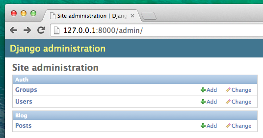
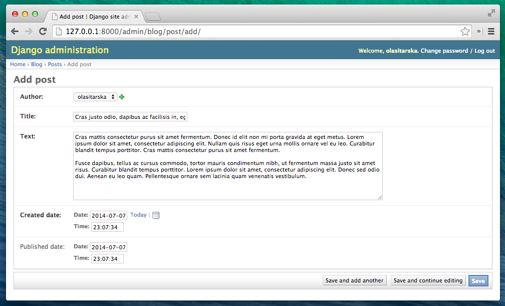

# Панель адміністрування Django

Для того, щоб додавати, редагувати і видаляти пости, які ми щойно змоделювали, ми будемо використовувати панель адміністрування Django.

Давайте відкриємо файл `blog/admin.py` у редакторі коду і замінимо його вміст на наступне:

blog/admin.py

```python
from django.contrib import admin
from .models import Post

admin.site.register(Post)
```

Як можна побачити, ми імпортуємо (включаємо) модель посту Post визначену у попередньому розділі. Щоб зробити нашу модель видимою на сторінці адміністратора, потрібно зареєструвати модель за допомогою `admin.site.register(Post)`.

Гаразд, час поглянути на нашу модель Post. Не забудьте виконати в консолі команду `python manage.py runserver` для того щоб запустити сервер. Відкрийте браузер і введіть адресу http://127.0.0.1:8000/admin/. Ви побачите сторінку входу яка виглядає наступним чином:


Щоб увійти, нам потрібно створити *superuser* (суперкористувача) - обліковий запис користувача, який має контроль над усім, що є на сайті. Поверніться до командного рядка, введіть `python manage.py createsuperuser`і натисніть Enter.

> Пам'ятайте, що для запису нових команд, поки веб-сервер працює, відкрийте нове вікно терміналу і активуйте Ваше віртуальне середовище (virtualenv). Ми розглядали, як написати нові команди в розділі **Ваш перший Django проект!** в секції **Запуск веб серверу**.

Mac OS X або Linux:

    (myvenv) ~/djangogirls$ python manage.py createsuperuser
    

Windows:

    (myvenv) C:\Users\Name\djangogirls> python manage.py createsuperuser
    

Коли вас про це запитають, введіть ім'я користувача (маленькими буквами без пробелів), адресу електронної пошти та пароль. **Не хвилюйтеся, що ви не можете бачити пароль, який вводите – так повинно бути.** Введіть його і натисніть `Enter` , щоб продовжити. Вихідний результат має виглядати наступним чином (де ім'я користувача і електронна пошта повинні бути вашими власними):

    Username: ola
    Email address: ola@example.com
    Password:
    Password (again):
    Superuser created successfully.
    

Поверніться до вашого браузера і здійсніть вхід використовуючи логін та пароль щойно створеного суперкористувача; ви маєте побачити робочу панель адміністратора Django.



Перейдіть до постів і трохи поекспериментуйте з ними. Додайте 5-6 постів до блогу. Не хвилюйтесь про зміст - його можна побачити лише на локальному комп'ютері — ви можете скопіювати якийсь текст з цього туторіалу, щоб зберегти час. :)

Переконайтесь у тому, що принаймні два або три поста (але не всі) мають встановлену дату публікації. Це стане у нагоді пізніше. 



If you want to know more about Django admin, you should check Django's documentation: https://docs.djangoproject.com/en/3.2/ref/contrib/admin/

Це напевне гарний час щоб налити кави (чи чаю) чи з’їсти щось щоб перезарядитися. Ви створили свою першу модель Django і заслуговуєте на короткий тайм-аут!