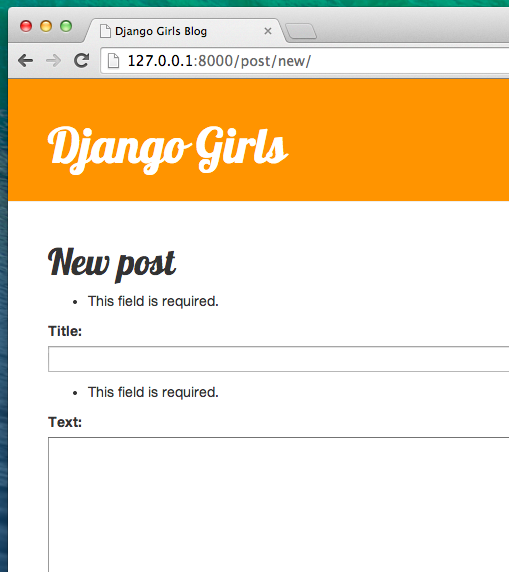

# Django форми

Остання річ, яку б ми хотіли зробити з нашим сайтом це створити зручний спосіб додавати і редагувати пости. Django адміністратор це звісно круто, але водночас він є досить складним для налаштування. За допомогою форм ми матимемо абсолютний контроль над нашим інтерфейсом - ми можемо робити майже все, що тільки можемо собі уявити!

Що тішить стосовно Django форм так це те, що останні можна визначати як з нуля так і створювати засобами `ModelForm`, що зберігають результат форми всередині моделі.

Це саме те, що нам потрібно: створимо форму для нашої моделі `Post`.

Як і кожна важлива складова Django, форми мають свій власний файл: `forms.py`.

Потрібно створити файл із заданим ім'ям в папці `blog`.

    blog
       └── forms.py
    

Гаразд, давайте відкриємо його в редакторі коду і наберемо такий код:

blog/forms.py

```python
from django import forms

from .models import Post

class PostForm(forms.ModelForm):

    class Meta:
        model = Post
        fields = ('title', 'text',)
```

Спочатку нам потрібно імпортувати форми Django (`from django import forms`) та нашу модель (`from .models import Post`).

`PostForm`, як ви можливо зазначили, ім'я нашої форми. Нам потрібно сказати Django, що ця форма є `ModelForm` ( тому Django зробить для нас трішки магії ) – ` і рядок.ModelForm` відповідає за це.

Далі, у нас є `class Meta`, де ми вказуємо для Django котра з моделей має бути використана для створення форми (`model = Post`).

Зрештою, можемо зазначити якими полями має закінчуватись наша форма. У цьому сценарії ми хочемо опублікувати такі параметри як заголовок `title` і зміст `text`, дані про автора `author`, що автоматично встановлюються як дані особи, яка наразі увійшла в систему (тобто ви!), а також дата створення `created_date`, яка автоматично встановлюється при створенні публікації (тобто в коді), вірно ж?

І це все! Все що нам потрібно тепер зробити це використати форму в блоці *view* і відобразити її в шаблоні.

То ж ще раз ми створимо посилання на сторінку, URL- адресу, вид і шаблон.

## Посилання на сторінку з формою

Перед тим, як додати посилання, нам потрібно використати деякі значки, як кнопки для посилання. For this tutorial, download [file-earmark-plus.svg](https://raw.githubusercontent.com/twbs/icons/main/icons/file-earmark-plus.svg) and save it in the folder `blog/templates/blog/icons/`

> Примітка: для того, щоб завантажити зображення SVG, відкрийте контекстне меню за посиланням (зазвичай натисканням правої кнопки миші) і виберіть "Зберегти посилання як". In the dialog asking you where to save the file, navigate to the `djangogirls` directory of your Django project, and within that to subdirectory `blog/templates/blog/icons/`, and save the file there.

It's time to open `blog/templates/blog/base.html` in the code editor. Тепер ми можемо використовувати значок файлу в базовому шаблоні наступним чином. У елементі `div` всередині секції `header`, додаємо посилання перед елементом `h1`:

blog/templates/blog/base.html

```html
<a href="" class="top-menu">
    
</a>
```

Зверніть увагу, що ми хочемо назвати наш новий огляд `post_new`. Значок [SVG](https://icons.getbootstrap.com/icons/file-earmark-plus/) представлений [Bootstrap Icons](https://icons.getbootstrap.com/) і він відобразить значок сторінки зі знаком плюс. Ми використовуємо директиву шаблону Django під назвою `include`. Це вводить вміст файлу до шаблону Django. Веббраузер знає, як обробляти цей тип контенту без будь-якої подальшої обробки.

> Ви можете завантажити всі значки Bootstrap [here](https://github.com/twbs/icons/releases/download/v1.1.0/bootstrap-icons-1.1.0.zip). Розархівуйте файл і скопіюйте всі файли з зображеннями SVG у нову папку `blog/templates/blog/` під назвою `icons`. Таким чином, Ви можете отримати доступ до такої іконки як `pencil-fill.svg`, використовуючи шлях до файлу `blog/templates/blog/icons/pencil-fill.svg`

Після редагування рядку, Ваш HTML файл повинен виглядати таким чином:

blog/templates/blog/base.html

```html

<!DOCTYPE html>
<html>
    <head>
        <title>Django Girls blog</title>
        <link rel="stylesheet" href="https://cdn.jsdelivr.net/npm/bootstrap@5.1.3/dist/css/bootstrap.min.css" integrity="sha384-1BmE4kWBq78iYhFldvKuhfTAU6auU8tT94WrHftjDbrCEXSU1oBoqyl2QvZ6jIW3" crossorigin="anonymous">
        <link href='//fonts.googleapis.com/css?family=Lobster&subset=latin,latin-ext' rel='stylesheet' type='text/css'>
        <link rel="stylesheet" href="">
    </head>
    <body>
        <header class="page-header">
            <div class="container">
                <a href="" class="top-menu">
                    
                </a>
                <h1><a href="/">Django Girls Blog</a></h1>
            </div>
        </header>
        <main class="content container">
            <div class="row">
                <div class="col">
                    
                    
                </div>
            </div>
        </main>
    </body>
</html>
```

Після зберігання та оновлення сторінки http://127.0.0.1:8000 Ви побачите знайому помилку `NoReverseMatch`. Чи так це насправді? 

## URL

Відкриваємо `blog/urls.py` у редакторі коду та додаємо рядок:

blog/urls.py

```python
шлях('post/new/', views.post_new, name='post_new'),
```

Остаточний код буде виглядати так:

blog/urls.py

```python
from django.urls import path
from . import views

urlpatterns = [
    path('', views.post_list, name='post_list'),
    path('post/<int:pk>/', views.post_detail, name='post_detail'),
    path('post/new/', views.post_new, name='post_new'),
]
```

After refreshing the site, we see an `AttributeError`, since we don't have the `post_new` view implemented. Let's add it right now.

## post_new view

Тепер відкриваємо у редакторі коду файл `blog/views.py` і додаємо наступні рядки з рештою рядків `from`:

blog/views.py

```python
from .forms import PostForm
```

And then our *view*:

blog/views.py

```python
def post_new(request):
    form = PostForm()
    return render(request, 'blog/post_edit.html', {'form': form})
```

Щоб створити нову форму `Post`, потрібно викликати `PostForm` і перенести її до шаблону. Ми повернемось до цього *зображення* пізніше, а зараз створімо шаблон для форми.

## Шаблон

Потрібно створити файл `post_edit.html`</code> у дирекції `blog/templates/blog</0>, і відкрити його у редакторі коду. Для того, щоб створити форму, необхідні декілька речей:</p>

<ul>
<li>Ми маємо відобразити форму. Можемо це зробити, наприклад, за допомогою <code>{{ form.as_p }}`. </li> 

* Вказаний рядок має бути розміщений всередині тега форми HTML: `<form method="POST">...</form>`.
* Нам знадобиться кнопка "Зберегти" - `Save`. Створимо її в HTML за допомогою виразу `<button type="submit">Save</button>`.
* І нарешті зразу після відкриття тегу форми `<form ...>` потрібно додати ``. Це дуже важливо з міркувань безпеки вашої форми! Якщо ви раптом забудете про цю деталь, Django поскаржиться, коли будете намагатися зберегти форму:</ul> 


Добре, розгляньмо як повинен виглядати код HTML у `post_edit.html`:

blog/templates/blog/post_edit.html

```html



    <h2>New post</h2>
    <form method="POST" class="post-form">
        {{ form.as_p }}
        <button type="submit" class="save btn btn-secondary">Save</button>
    </form>

```

Час оновити сторінку! Гаразд! Ваша форма відображується!


Зачекайте! Коли Ви набираєте щось в полях `title` і `text`, намагаючись зберегти це, то що може статися?

Нічого! Ми знову опинимось на цій самій сторінці та наш текст зникне...жодного нового поста також не буде додано. Отже, що пішло не так?

Відповідь: нічого. Ми мусимо виконати трохи більше роботи в нашому *view<0>.</p> 

## Зберігання форми

Відкрийте `log/views.py` ще раз у редакторі коду. Наразі все, що ми маємо в `post_new` це:

blog/views.py

```python
def post_new(request):
    form = PostForm()
    return render(request, 'blog/post_edit.html', {'form': form})
```

Коли відправляємо форму, ми потрапляємо у той самий view, але цього разу маємо трохи більше даних у `request`, точніше в `request.POST` (ця назва не пов'язана з блогерським терміном "пост"; вона стосується того, що ми "постимо" дані). Пам'ятайте, що у файлі HTML, наше визначення `<form>` містило змінну `method="POST"`? Усі поля форми на цей час знаходяться в `request.POST`. Ви не повинні перейменовувати `POST` на щось інше (єдиним дійсним альтернативним значенням для `method` є `GET`, але ми не маємо часу пояснювати в чому проявляється різниця).

Отже, у нашому *view* ми маємо дві окремі ситуації, які треба обробити: перша, коли ми вперше отримуємо доступ до сторінки й хочемо отримати порожню форму, а друга, коли ми повертаємось до *view* з усіма даними форми, які ми щойно набрали. Таким чином, ми маємо додати умову (використаємо для цього `if`):

blog/views.py

```python
if request.method == "POST":
    [...]
else:
    form = PostForm()
```

Час заповнити крапки `[...]`. Якщо `method` являє собою `POST`, тоді ми хочемо створити `PostForm` з даними форми, чи не так? Ми зробимо це наступним чином:

blog/views.py

```python
form = PostForm(request.POST)
```

Наступний крок - перевірити правильність форми (усі обов'язкові поля були встановлені й не з'явилися неправильні значення). Ми робимо це за допомогою `form.is_valid()`.

Ми перевіряємо чи є форма дійсною, якщо це так, то ми можемо її зберегти!

blog/views.py

```python
if form.is_valid():
    post = form.save(commit=False)
    post.author = request.user
    post.published_date = timezone.now()
    post.save()
```

В основі, маємо тут два моменти: зберігаємо форму за допомогою `form.save` і додаємо автора (оскільки поле автор `author` було відсутнє в `PostForm` і це поле є необхідним). `commit=False` це означає, що ми не хочемо поки зберігати модель `Post` - спочатку ми хочемо додати ім'я автора. Більшу частину часу Ви будете використовувати `form.save()` без `commit=False`, але у цьому випадку, нам слід застосувати його. `post.save()` збереже зміни (додаючи автора) і створиться новий блог!

Нарешті, було б чудово, якщо ми могли б відразу переходити на сторінку `post_detail` для щойно створеного допису у блозі, чи не так? Для того, щоб зробити це нам необхідно виконати ще один імпорт: 

blog/views.py

```python
from django.shortcuts import redirect
```

Додайте це на початку Вашого файлу. Тепер ми можемо сказати, "перейдіть на сторінку `post_detail` для перегляду нової публікації":

blog/views.py

```python
return redirect('post_detail', pk=post.pk)
```

`post_detail` це назва виду, до якого хочемо перейти. Пам'ятайте, що *view* потребує змінну `pk`? Щоб здійснити передачу вище згаданої змінної, скористаємося `pk=post.pk`, де `post` є новоствореним постом!

Добре, занадто багато балачок, напевно ми хотіли б побачити як цілком зараз виглядає *view*, чи не так?

blog/views.py

```python
def post_new(request):
    if request.method == "POST":
        form = PostForm(request.POST)
        if form.is_valid():
            post = form.save(commit=False)
            post.author = request.user
            post.published_date = timezone.now()
            post.save()
            return redirect('post_detail', pk=post.pk)
    else:
        form = PostForm()
    return render(request, 'blog/post_edit.html', {'form': form})
```

Подивимося, чи це працює. Перейдіть на сторінку http://127.0.0.1:8000/post/new/, додайте `title` і `text`, збережіть і готово! Новий блог пост додано і нас перенаправлено на сторінку `post_detail` !

Напевно Ви помітили, що ми встановлюємо дату публікації перед збереженням поста. Згодом, ми представимо *кнопку публікації* в **Django Girls Tutorial: Extensions**.

Просто чудово!

> Оскільки нещодавно ми працювали з інтерфейсом адміністратора Django, система вважає, що ми увійшли в систему. Є декілька ситуацій, які могли призвести до виходу з системи (закриття браузера, перезапуск бази даних тощо). Якщо під час створення допису, Ви помітите, що у Вас з'являються помилки, пов'язані з відсутністю зареєстрованого користувача, перейдіть на сторінку адміністратора http://127.0.0.1:8000/admin й увійдіть знову. Проблему тимчасово буде вирішено. Довгострокове розв'язання проблеми чекає на Вас у розділі **Домашня робота: додаємо безпеки Вашому вебсайту!** після основного туторіалу.


## Form validation

А тепер ми покажемо Вам наскільки круто використовувати форми Django. Блог пост повинен мати такі поля як `заголовок`</code> і `текст</0>. У нашій моделі <code>Post` ми не зазначили, що ці поля (на відміну від `published_date`) не є обов'язковими, тому Django, за замовчуванням, очікує, що вони будуть встановлені.

Намагайтесь зберегти форму без `заголовку` й `тексту`. Вгадайте, що відбудеться!



Django дбає про те, щоб перевірити правильність всіх полів у нашій формі. Хіба це не чудово? 

## Edit form

Тепер ми знаємо як додавати новий пост. А якщо ми захочемо відредагувати ту, що вже існує? Це дуже схоже на те, що ми щойно зробили. Давайте швиденько створимо кілька важливих речей. (Якщо Ви не розумієте щось, Вам слід запитати свого наставника або переглянути попередні розділи, оскільки ми вже розглянули всі ці кроки).

Спочатку, збережемо значок, який зображає кнопку редагування. Завантажте [pencil-fill.svg](https://raw.githubusercontent.com/twbs/icons/main/icons/pencil-fill.svg) й збережіть його на місце `blog/templates/blog/icons/`.

Відкрийте `blog/templates/blog/post_detail.html` у кодовому редакторі й додайте наступний код всередину елементу `article` :

blog/templates/blog/post_detail.html

```html
<aside class="actions">
    <a class="btn btn-secondary" href="">
      
    </a>
</aside>
```

Отже, шаблон буде мати такий вигляд:

blog/templates/blog/post_detail.html

```html



    <article class="post">
        <aside class="actions">
            <a class="btn btn-secondary" href="">
                
            </a>
        </aside>
        
            <time class="date">
                {{ post.published_date }}
            </time>
        
        <h2>{{ post.title }}</h2>
        <p>{{ post.text|linebreaksbr }}</p>
    </article>

```

Відкрийте `blog/urls.py` в кодовому редакторі, і додайте цей рядок:

blog/urls.py

```python
    path('post/<int:pk>/edit/', views.post_edit, name='post_edit'),
```

Використовуємо повторно шаблон `blog/templates/blog/post_edit.html`, таким чином, останньою відсутньою річчю є *view*.

Відкриємо `blog/views.py` у кодовому редакторі й додамо це наприкінці файлу:

blog/views.py

```python
def post_edit(request, pk):
    post = get_object_or_404(Post, pk=pk)
    if request.method == "POST":
        form = PostForm(request.POST, instance=post)
        if form.is_valid():
            post = form.save(commit=False)
            post.author = request.user
            post.published_date = timezone.now()
            post.save()
            return redirect('post_detail', pk=post.pk)
    else:
        form = PostForm(instance=post)
    return render(request, 'blog/post_edit.html', {'form': form})
```

Це виглядає майже точно так, як і наш `post_new`, чи не так? Але не зовсім. По-перше, переносимо додатковий параметр `pk` з `URL-адреси`. Наступним кроком, отримуємо модель `Post`, яку хотіли б відредагувати як `get_object_or_404(Post, pk=pk)` і після цього, при створенні форми, переносимо цей пост як `приклад`, при збереженні форми...

blog/views.py

```python
form = PostForm(request.POST, instance=post)
```

...а коли просто відкриваємо форму з цим постом для редагування:

blog/views.py

```python
form = PostForm(instance=post)
```

Добре, перевіримо чи все працює! Перейдімо на сторінку `post_detail`. У верхньому правому куті має бути кнопка редагування:


Коли Ви натисните на неї, Ви побачите форму з нашим блог постом:


Ви можете вільно змінювати заголовок або текст і зберегти зміни!

Вітаємо! Ваш додаток стає все більш завершеним!

Якщо Ви хочете дізнатись більше про форми Django, Вам слід ознайомитись із документацією: https://docs.djangoproject.com/en/3.2/topics/forms/

## Безпека

Можливість створювати нові пости, натискаючи на посилання - це круто! Але тепер, будь-яка людина, яка відвідує Ваш сайт, зможе створити новий блог пост, і, мабуть, це не те, що Ви хотіли б. Зробім так, щоб кнопка була показана для Вас, а не для інших людей.

У кодовому редакторі відкрийте `blog/templates/blog/base.html`, знайдіть `div` всередині `header` і тег посилання, який Ви додали туди раніше. Це має виглядати так:

blog/templates/blog/base.html

```html
<a href="" class="top-menu">
    
</a>
```

Ми збираємось додати до цього інший тег ``, який буде показувати посилання тільки тим користувачам, які ввійшли від імені адміністратора. Саме зараз, це Ви! Змініть елемент `<a>`, щоб він виглядав так:

blog/templates/blog/base.html

```html

    <a href="" class="top-menu">
        
    </a>

```

`` зробить так, що посилання будуть відправлятися браузеру тільки, якщо користувач, що запитує сторінку, увійшов у систему. Це не повністю захищає від створення нових публікацій, але це хороший перший крок. Ми розглянемо більше питань, пов'язаних з безпекою, в розширених уроках.

Пам'ятайте, що значок редагування, який ми щойно додали на сторінку деталей? Ми також хотіли б додати таку ж зміну сюди, щоб інші люди не мали змоги редагувати пости, що вже існують.

Відкрийте `log/templates/blog/post_detail.html` у кодовому редакторі й знайдіть наступний рядок:

blog/templates/blog/post_detail.html

```html
<a class="btn btn-secondary" href="">
    
</a>
```

Змініть його на цей:

blog/templates/blog/post_detail.html

```html

     <a class="btn btn-secondary" href="">
        
     </a>

```

Оскільки Ви, скоріше за все, увійшли в систему, якщо Ви оновите сторінку, то не побачите ніяких змін. Завантажте сторінку в іншому браузері або вікні анонімного перегляду (яке називається "InPrivate" у Windows Edge), однак, Ви побачите, що посилання і значок не відображаються!

## Ще одне: розгортання!

Погляньмо чи все працює на PythonAnywhere. Час для ще одного розгортання!

* Спочатку зафіксуйте свій новий код і зробіть його на GitHub:

command-line

    $ git status
    $ git add .
    $ git status
    $ git commit -m "Додано подання для створення / редагування публікації в блозі сайту."
    $ git push
    

* Тоді, в [bash консолі PythonAnywhere](https://www.pythonanywhere.com/consoles/):

PythonAnywhere command-line

    $ cd ~/<your-pythonanywhere-domain>.pythonanywhere.com
    $ git pull
    [...]
    

(Не забудьте замінити `<your-pythonanywhere-domain>` Вашим актуальним субдоменом PythonAnywhere, без кутових дужок.)

* Нарешті, перейти на сторінку ["Web"](https://www.pythonanywhere.com/web_app_setup/) ( використати кнопку меню у верхньому правому куті консолю ) та натисніть **Перезавантажити**. Оновіть свій https://subdomain.pythonanywhere.com блог, щоб почати зміни.

На цьому все! Вітаємо! :)