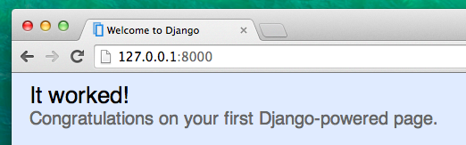

# URL - адреси Django

Ми збираємось створити нашу першу вебсторінку: домашню сторінку для Вашого блогу! Але спочатку, давайте розберемось, що таке URL-адреси Django.

## Що таке URL - адреса?

URL - адреса — це вебадреса. Ви можете побачити URL- адресу кожного разу, як Ви заходите на вебсайт — її видно в адресному рядку вашого браузера. (Так! `127.0.0.1:8000` - це URL - адреса! І `https://djangogirls.org` - це також URL - адреса. 



Кожній сторінці в Інтернеті потрібна своя власна URL - адреса. Таким чином Ваш додаток знає, що потрібно показати користувачу, який переходить за URL - адресою. В Django ми використовуємо щось на кшталт `URLconf` (конфігурація URL - адреси). Конфігурація URL - адреси — це набір шаблонів, які Django намагатиметься зіставити з отриманими URL - адресами, щоб знайти правильну вебсторінку.  

## Як працє URL - адреса в Django?

Давайте відкриємо файл `mysite/urls.py` в редакторі коду і подивимось, як він виглядає:

mysite/urls.py

```python
"""mysite URL Configuration

[...]
"""
from django.contrib import admin
from django.urls import path

urlpatterns = [
    path('admin/', admin.site.urls),
]
```

Як Ви бачите, Django самостійно дещо поставив для нас. 

Рядки між потрійними лапками (`'''` or `"""`) називаються рядками документів — ви можете поставити їх у верхній частині файлу, класу або методу, щоб описати, що саме він робить.   Вони не будуть керуватися Python.

URL-адреса адміністратора, яку Ви відвідали в попередньому розділі, вже тут:

mysite/urls.py

```python
    path('admin/', admin.site.urls),
```

Цей рядок означає, що для кожної URL-адреси, яка починається з `admin/`, Django знайде відповідний *view*. В цьому випадку ми включаємо багато URL-адрес адміністратора, щоб вони всі не були закладені в один невеликий файл – так його легше читати та він стає чистіший. 

## Ваша перша URL-адреса Django!

Час створити нашу першу URL-адресу! Ми хочемо, щоб «http://127.0.0.1:8000/» став домашньою сторінкою нашого блогу та відображав список публікацій.

Ми також хочемо, щоб файл `mysite/urls.py` був чистим, тому ми імпортуємо URL-адреси з нашого додатку `blog` до головного файлу `mysite/urls.py</ 0>.</p>

<p>Далі додайте рядок, який імпортує <code>blog.urls`. Вам також потрібно буде змінити рядок `from django.urls…`, оскільки тут ми використовуємо функцію `include`, тому вам потрібно буде додати цей імпорт до цього рядка.

Ваш файл `mysite/urls.py` тепер повинен виглядати наступним чином:

mysite/urls.py

```python
from django.contrib import admin
from django.urls import path, include

urlpatterns = [
    path('admin/', admin.site.urls),
    path('', include('blog.urls')),
]
```

Тепер Django буде перенаправляти все, що надходить в 'http://127.0.0.1:8000/', на `blog.urls` і шукатиме там подальші інструкції.

## blog.urls

Створіть новий порожній файл з іменем `urls.py` у каталозі `blog` і відкрийте його в редакторі коду. Добре! Додайте ці перші два рядки: 

blog/urls.py

```python
from django.urls import path
from . import views
```

Тут ми імпортуємо функцію Django `path` і всі наші `views` з додатка `blog`. (У нас їх ще немає, але ми повернемося до цього за хвилину!)

Після цього ми можемо додати наш перший шаблон URL-адреси:

blog/urls.py

```python
urlpatterns = [
    path('', views.post_list, name='post_list'),
]
```

Як бачимо, зараз ми присвоюємо `view` під назвою `post_list` до кореневої URL-адреси. Цей шаблон URL-адреси відповідатиме порожньому рядку, а розпізнавач URL-адрес Django ігноруватиме ім’я домену (тобто http://127.0.0.1:8000/), яке стоїть спереду URL-адреси. Цей шаблон показуватиме Django, що `views.post_list` є правильним місцем для переходу, якщо хтось зайде на Ваш вебсайт за адресою 'http://127.0.0.1:8000/'.

Ш останнє, `name='post_list'` є назвою URL-адреси, яка буде використовуватися для ідентифікації огляду. Це може бути ім'ям потрібного нам огляду або ж чимось зовсім іншим. Ми продовжимо використовувати названі URL-адреси в цьому проєкті, тому важливо назвати кожну URL-адресу в програмі. Нам також потрібно назвати URL-адреси так, щоб вони були унікальними й легко запам’ятовувалися. 

Якщо ви спробуєте зараз перейти на http://127.0.0.1:8000/, Ви побачите щось на кшталт «вебсторінка недоступна». Це тому, що сервер (пам’ятаєте, ми ввели `runserver`?) більше не працює. Подивіться у вікні консолі Вашого сервера, щоб дізнатися, чому.

{{ warning_icon }} command-line

        return _bootstrap._gcd_import(name[level:], package, level)
      File "<frozen importlib._bootstrap>", line 1030, in _gcd_import
      File "<frozen importlib._bootstrap>", line 1007, in _find_and_load
      File "<frozen importlib._bootstrap>", line 986, in _find_and_load_unlocked
      File "<frozen importlib._bootstrap>", line 680, in _load_unlocked
      File "<frozen importlib._bootstrap_external>", line 850, in exec_module
      File "<frozen importlib._bootstrap>", line 228, in _call_with_frames_removed
      File "/Users/ola/djangogirls/blog/urls.py", line 5, in <module>
        path('', views.post_list, name='post_list'),
    AttributeError: module 'blog.views' has no attribute 'post_list'
    

Ваша консоль показує помилку, але не хвилюйтеся – це насправді дуже добре: це говорить про те, що **attribute 'post_list'** відсутній. Це назва *view*, яке Django намагається знайти та використати, але ми його ще не створили. На цьому етапі `/admin/` також не буде працювати. Не хвилюйтеся, про це ми поговоримо також. Якщо Ви бачите інше повідомлення про помилку, спробуйте перезавантажити Ваш вебсервер. Для цього у вікні консолі, де запущено вебсервер, зупиніть його, натиснувши Ctrl+C (клавіші Control і C разом). У Windows, можливо, потрібно натиснути Ctrl+Break. Потім Вам потрібно перезавантажити вебсервер, запустивши команду `python manage.py runserver`. 

> If you want to know more about Django URLconfs, look at the official documentation: https://docs.djangoproject.com/en/3.2/topics/http/urls/