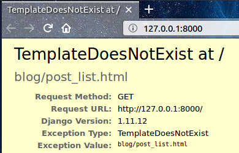

# Django відображення - час творити!

Час позбутися помилки, створеної в останньому розділі! :)

Відображення - *view* -- це місце, в якому ми закладаємо "логіку" нашої програми. Воно запитує інформацію з `моделі`, яку ми створили раніше і передає його до `шаблону`. Ми створимо шаблон в наступному розділі . Перегляди — це лише функції Python, які трохи складніші, ніж ті, які ми писали у розділі **Вступ до Python**.

Відображення розташовані у файлі `views.py`. Додамо наші відображення до файлу `blog/views.py`.

## blog/views.py

Добре, давайте відкриємо цей файл у нашому редакторі коду і подивимося, що там :

blog/views.py

```python
from django.shortcuts import render

# Create your views here.
```

Поки що тут ще майже нічого немає. 

Пам’ятайте, що рядки, які починаються з `#`, є коментарями, а це означає, що Python не запускатиме ці рядки.

Давайте створимо *view*, як пропонує коментар. Додайте наступний мінімальний огляд нижче:

blog/views.py

```python
def post_list(request):
    return render(request, 'blog/post_list.html', {})
```

Як бачите, ми створили функцію (`def`) під назвою `post_list`, яка приймає `запит` і `поверне` значення, яке він отримує від виклику іншої функції `render`, яка відтворить (збере разом) наш шаблон `blog/post_list.html`.

Збережіть файл, перейдіть на http://127.0.0.1:8000/, щоб подивитися, що ми отримали.

Інша помилка! Прочитайте у чому цього разу справа:



Це свідчить про те, що сервер знову працює, принаймні, але все одно виглядає не так, чи не так? Не хвилюйтеся, це просто сторінка з помилкою, нічого боятися! Як і повідомлення про помилки в консолі, вони насправді є дуже корисними. Ви можете побачити, що *TemplateDoesNotExist*. Давайте виправимо цю помилку та створимо шаблон у наступному розділі!

> Learn more about Django views by reading the official documentation: https://docs.djangoproject.com/en/3.2/topics/http/views/