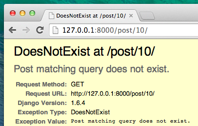



# Розширте свою програму

Ми вже завершили всі етапи необхідні для створення нашого сайту: ми знаємо як написати модель, адресу URL, вигляд та шаблон. Ми також знаємо як зробити сайт привабливим.

Час попрактикуватись!

Перша річ, яка має бути у нашому блозі - це, очевидно, сторінка, що відображує один пост, правильно?

Ми вже маємо модель </code>посту`, тому не потрібно нічого додавати до <code>models.py`.

## Створюємо в шаблоні посилання на сторінку посту

Ми розпочнемо із додавання посилання всередині `blog/templates/blog/post_list.html` файлу. Відкрийте його в редакторі коду і поки що воно має виглядати так: blog/templates/blog/post_list.html

```html



    
        <article class="post">
            <time class="date">
                {{ post.published_date }}
            </time>
            <h2><a href="">{{ post.title }}</a></h2>
            <p>{{ post.text|linebreaksbr }}</p>
        </article>
    

```

Ми хочемо, щоб в списку постів в заголовку було посилання на сторінку детальної інформації про пост. Давайте змінимо `<h2><a href="">{{ post.title }}</a></h2>` так, щоб було посилання на сторінку з детальною інформацією про пост:

{{ warning_icon }} blog/templates/blog/post_list.html

```html
<h2><a href="">{{ post.title }}</a></h2>
```

Час пояснити дивний запис ``. Як і очікувалось, `` означає, що ми використовуємо шаблонні теги Django. На цей раз ми використаємо один, який створить адресу URL для нас! 

`post_detail` частина означає, що Django буде очікувати адресу URL у `blog/urls.py` з назвою=post_detail

А як щодо `pk=post.pk`? `pk` - це скорочення від первинного ключа, що є унікальним ідентифікатором для кожного запису в базі даних. Кожна модель Django має поле, яке виступає як первинний ключ і будь-яку іншу назву воно маже мати, це також може називатися "pk". Тому що ми не вказали основного ключа в моделі `поста`, Django створює одне для нас (за замовчуванням, поле з назвою "id", що збільшується на усі записи, наприклад 1,2,3) і додає це поле в кожну з наших записів. Ми маємо доступ до первинного ключа, записуючи `post.pk`, так само як ми отримуємо доступ до інших полів (`назва`,`автор` і т.д.) у нашому об'єкті `пост`!

Тепер, коли ми переходимо до http://127.0.0.1:8000/, ми отримуємо помилку (як і оікувалось, оскільки у нас немає адреси URL або потрібного *вигляду* для `post_detail`. Це буде виглядати наступним чином:


## Створюєм адресу URL для деталей запису

Давайте створимо адресу URL на `urls.py` для нашого *вигляду* `post_detail`!

Ми хочемо, щоб наш перший пост був доступний за такою адресою **URL**: http://127.0.0.1:8000/post/1/ 

Давайте створимо адресу URL в файлі `blog/urls.py` і вкажемо Django на *вигляд* з назвою `post_detail`, який буде відображати пост цілком. Відкрийте файл `blog/urls.py` в редакторі коду і додайте рядок `path('post/<int:pk>/', views.post_detail, name='post_detail'),` так щоб файл виглядав так:

{{ warning_icon }} blog/urls.py

```python
from django.urls import path
from . import views

urlpatterns = [
    path('', views.post_list, name='post_list'),
    path('post/<int:pk>/', views.post_detail, name='post_detail'),
]
```

Ця частина `post<int:pk>/` визначає шаблон адреси URL - ми пояснимо це вам:

- `post` означає, що URL-адреса має починатися зі слова **post** з такою назвою ****. Все йде правильно.
- `<int:pk>` - ця частина складніша. Це означає, що Django очікує ціле значенння і передасть його до вигляду як змінну `pk`.
- `/` - тоді нам знадобиться **/** після завершення URL-адреси.

Це означає, що якщо ви введете `http://127.0.0.1:8000/post/5/`, Django зрозуміє, що ви шукаєте відображення із назвою `post_detail` і передає цьому відображенню інформацію, що `pk` дорівнює `5`.

Гаразд, ми додали новий шаблон URL-адрес до `blog/urls.py`! Оновімо сторінку: http://127.0.0.1:8000/ Бум!  Сервер знову перестав працювати. Подивіться на консоль – як і очікувалося, там ще одна помилка!

{{ warning_icon }} command-line

        return _bootstrap._gcd_import(name[level:], package, level)
      File "<frozen importlib._bootstrap>", line 1030, in _gcd_import
      File "<frozen importlib._bootstrap>", line 1007, in _find_and_load
      File "<frozen importlib._bootstrap>", line 986, in _find_and_load_unlocked
      File "<frozen importlib._bootstrap>", line 680, in _load_unlocked
      File "<frozen importlib._bootstrap_external>", line 850, in exec_module
      File "<frozen importlib._bootstrap>", line 228, in _call_with_frames_removed
      File "/Users/ola/djangogirls/blog/urls.py", line 6, in <module>
        path('post/<int:pk>/', views.post_detail, name='post_detail'),
    AttributeError: module 'blog.views' has no attribute 'post_detail'
    

Пригадуєте, який наступний крок? Потрібно додати огляд!

## Додамо деталі відображення запису

Цього разу нашій функції*огляд* надано додатковий параметр - `pk`. Наш *огляд* має вилучити його, чи не так? Тому ми визначимо нашу функцію як `def post_detail(request, pk):`. Зверніть увагу, що цей параметр повинен мати те саме ім’я, яке ми вказали в `urls` (`pk`). Також зверніть увагу і на те, що пропуск цієї змінної є неправильним і призведе до помилки!

Тепер, ми б хотіли отримати одну-єдину публікацію в блозі. Для цього ми можемо використовувати набори запитів, наприклад:

{{ warning_icon }} blog/views.py

```python
Post.objects.get(pk=pk)
```

Однак, в цьому коді є проблема. Якщо немає `пудблікації` із заданим `первинним ключем` (`pk`), ми отримаємо жахливу помилку!



Ми цього не хочемо! Але, на щастя, Django має деякі інструменти, які впораються з цим без нас: `get_object_or_404`. У випадку, якщо немає `Публікації` із заданим `pk`, відобразиться набагато краща сторінка, так звана `Page Not Found 404`.


Хороша новина полягає в тому, що Ви можете створити свою власну сторінку `Сторінку не знайдено` і зробити її настільки гарною, наскільки Вам заманеться. Однак, зараз цей крок не є надто важливим, тому ми опустимо його. 

Гаразд, час додати *огляд* до нашого файлу `views.py`!

У `blog/urls.py` ми створили правило URL-адреси з ім'ям `post_detail`, яке посилається на огляд під назвою `views.post_detail`. Це означає, що Django очікуватиме функцію огляду під назвою `post_detail` всередині `blog/views.py`.

Нам слід відкрити `blog/views.py` у редакторі коду та додати наступний код поряд з іншими рядками `from`:

blog/views.py

```python
from django.shortcuts import render, get_object_or_404
```

І в кінці файлу ми додамо наш *огляд*:

blog/views.py

```python
def post_detail(request, pk):
    post = get_object_or_404(Post, pk=pk)
    return render(request, 'blog/post_detail.html', {'post': post})
```

Так. Прийшов час оновити сторінку: http://127.0.0.1:8000 /


Спрацювало! Але що ж відбудеться, коли Ви клікните на посилання в заголовку публікації?


О ні! Ще одна помилка! Але ми вже знаємо, що потрібно робити в такому випадку, чи не так? Нам потрібно додати шаблон!

## Створюємо шаблон для деталей публікації

Створимо файл у `blog/templates/blog`, назвемо його `post_detail.html` і відкриємо його в редакторі коду.

Введіть наступний код:

blog/templates/blog/post_detail.html

```html



    <article class="post">
        
            <time class="date">
                {{ post.published_date }}
            </time>
        
        <h2>{{ post.title }}</h2>
        <p>{{ post.text|linebreaksbr }}</p>
    </article>

```

Ми знову розширюємо `base.html`. У блоці `content` ми хочемо показати дату публікації (якщо вона існує), назву та текст посту. Але ми мусимо обговорити певні важливі речі, чи не так?

` ... ` - це тег шаблону, який ми можемо використовувати, коли хочемо щось перевірити. (Запам'ятати `, якщо ... ще ...` з **Вступ до розділу Python**?) У цьому сценарії ми хочемо перевірити, чи `published_date` не порожня.

Гаразд, ми можемо оновити нашу сторінку та перевірити, чи зник `TemplateDoesNotExist`.


Ура! Працює!

# Час розгортання! 

Було б добре перевірити, чи Ваш вебсайт все ще працює на PythonAnywhere, вірно? Давайте спробуємо розгорнути його ще раз.

command-line

    $ git status
    $ git add .
    $ git status
    $ git commit -m "Added view and template for detailed blog post as well as CSS for the site."
    $ git push
    

Потім у [ Bash консолі PythonAnywhere](https://www.pythonanywhere.com/consoles/):

командний рядок PythonAnywhere

    $ cd ~/<your-pythonanywhere-domain>.pythonanywhere.com
    $ git pull
    [...]
    

(Не забудьте замінити `<your-pythonanywhere-domain>` своїм фактичним субдоменом PythonAnywhere без кутових дужок.)

## Оновлення статичних файлів на сервері

Сервери, такі як PythonAnywhere, люблять поводитись з "статичними файлами" (наприклад, файли CSS) інакше, аніж з файлами Python, оскільки вони можуть оптимізувати їх для швидшого завантаження. Як результат, щоразу, коли ми вносимо зміни до наших файлів CSS, нам потрібно запустити додаткову команду на сервері, щоб сервер зміг оновити їх. Команда називається `collectstatic`.

Почніть з активації вашого віртуального середовища, якщо воно все ще не активне після поперендіх кроків (PythonAnywhere використовує для цього команду під назвою `workon`, вона схожа на команду `source myenv/bin/activate`, яку Ви використовуєте на власному комп'ютері):

командний рядок PythonAnywhere

    $ workon <your-pythonanywhere-domain>.pythonanywhere.com
    (ola.pythonanywhere.com)$ python manage.py collectstatic
    [...]
    

Команда `manage.py collectstatic` трохи схожа на `manage.py migrate`. Ми внесемо деякі зміни до нашого коду, а потім наказуємо Django *застосувати* ці зміни або до колекції статичних файлів сервера, або до бази даних.

У будь-якому випадку, тепер ми готові перейти до ["Веб"сторінки](https://www.pythonanywhere.com/web_app_setup/) (потрібно клікнути на кнопку меню у верхньому правому куті консолі) і обрати **Перезавантажити** і нарешті перегляньте сторінку https://subdomain.pythonanywhere.com, щоб побачити результат.

На цьому все! Вітаємо! :)