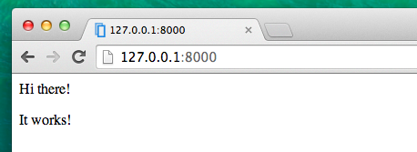
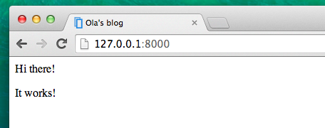

# Вступ до HTML

Ви можете запитати, що таке шаблон?

Шаблон – це файл, який ми можемо повторно використовувати для представлення різної інформації в послідовному форматі – наприклад, Ви можете використовувати шаблон, для допомоги у написанні листа, оскільки, хоча кожен лист може містити різні повідомлення та бути адресованим іншій особі, всі повідомлення матимуть однаковий формат.

Формат шаблону Django описується мовою HTML (це HTML, про який ми згадували в першому розділі **Як працює Інтернет**).

## Що таке HTML?

HTML – це код, який інтерпретується Вашим веббраузером, таким як Chrome, Firefox або Safari, для відображення вебсторінки для користувача.

HTML розшифровується як "Мова розмітки гіпертексту". **Гіпертекст** означає тип тексту, який підтримує гіперпосилання між сторінками. **Markup** (розмітка) означає, що ми отримали документ із розміченим кодом для того, щоб повідомити дещо (у даному випадку, браузер) як треба інтерпретувати сторінку. HTML код побудований за допомогою **тегів**, кожен з яких починається із `<` і закінчується `>`. Теги представляють **елементи розмітки**.

## Ваш перший шаблон!

Під створенням шаблону мається на увазі створення файлу шаблону. Будь-що є файлом, чи не так? Ви, напевно, це вже зауважили.

Шаблони зберігаються в папці `blog/templates/blog`. Отже, спершу створіть папку із назвою `templates` всередині вашої папки blog. Далі створіть іншу папку із назвою `blog` всередині вашої папки templates:

    blog
    └───templates
        └───blog
    

(У Вас може виникнути питання, навіщо нам потрібні два каталоги, які називаються `blog` – Ви пізніше дізнаєтеся, що це зручне узгодження імен, яке полегшує життя, коли все ускладнюється.)

А тепер створіть файл `post_list.html` (просто залиште його поки що пустим) всередині папки `blog/templates/blog`.

Погляньте як тепер виглядає ваш веб сайт: http://127.0.0.1:8000/

> Якщо у Вас все ще не зникає помилка `TemplateDoesNotExist`, спробуйте перезапустити сервер. Перейдіть до командного рядка, зупиніть сервер, натиснувши Ctrl+C (клавіші Control і C разом) і запустіть його знову, виконавши команду `python manage.py runserver`.


Помилки більше немає! Вітання! :) Однак,  Ваш вебсайт насправді не публікує нічого, крім порожньої сторінки, оскільки ваш шаблон також порожній. Нам потрібно це виправити.  

Відкрийте новий файл у редакторі коду та додайте наступне:

blog/templates/blog/post_list.html

```html
<html>
<body>
    <p>Hi there!</p>
    <p>It works!</p>
</body>
</html>
```

То як тепер виглядає Ваш сайт? Перейдіть за посиланням, щоб дізнатися: http://127.0.0.1:8000/



Спрацювало. Гарна робота! :)

* Рядок `<!DOCTYPE html>` не є тегом HTML. Він лише показує тип документа. Тут він показує браузеру, що тип документа [HTML5](https://html.spec.whatwg.org/#the-doctype). Так завжди починається будь-який файл HTML5.
* Найпростіший тег `<html>` завжди є початком будь-якої html сторінки, а `</html>` завжди є кінцем. Як бачите, весь контент вебсайту розміщений між початковим тегом `<html>` і закриваючим тегом `</html>`
* `<p>` — тег для елементів абзацу; `</p>` закриває кожен абзац

## Заголовок та тіло документу HTML

Кожну сторінку HTML також можна поділити на два елементи: **head** - (голова) і **body** - (тіло.

* **head** - елемент, що містить інформацію про документ, яка не відображається на екрані.

* **body** - елемент, що містить усе інше, що відображається як частина веб сторінки.

Ми використовуємо `<head>` щоб повідомити браузер про конфігурацію сторінки, а `<body>` щоб повідомити браузер, що у дійсності знаходиться на сторінці.

Наприклад, Ви можете помістити елемент заголовка вебсторінки всередині `<head>`, якщо виконаєте наступні дії:

blog/templates/blog/post_list.html

```html
<!DOCTYPE html>
<html>
    <head>
        <title>Ola's blog</title>
    </head>
    <body>
        <p>Hi there!</p>
        <p>It works!</p>
    </body>
</html>
```

Збережіть файл і перезавантажте вашу сторінку.



Зауважте як браузер зрозумів , що "Ola's blog" це заголовок вашої сторінки? Він інтерпретував `<title>Ola's blog</title>` і розмістив текст у рядку заголовка вашого браузера (він також буде використаний для закладок чи інших речей).

Можливо, ви також зауважили, що кожен відкриваючий тег відповідає *закриваючому тегу*, із `/`, і ці елементи є *вкладеними* (тобто ви не можете закрити окремий тег поки усі теги, що містяться всередині не будуть також закриті).

Це щось на кшталт як покласти речі всередину ящиків. У вас є один великий ящик, `<html></html>`; всередині цього ящика є `<body></body>`, що містить ще менші ящики: `<p></p>`.

Ви повинні керуватися цими правилами працюючи з тегами *закривання* та *вкладених* елементів – якщо Ви цього не зробите, браузер не зможе правильно їх інтерпретувати, і Ваша сторінка буде відображатися неправильно.

## Налаштуйте ваш шаблон

А тепер можете трохи побавитися і спробувати налаштувати ваш шаблон! Тут наведено декілька корисних тегів для цього:

* `<h1>Заголовок</h1>` для Вашого найважливішого заголовка
* `<h2>Підзаголовок</h2>` для заголовків наступного рівня
* `<h3>Підзаголовок</h3>` …і так далі, аж до `<h6>`
* `<p>Абзац тексту</p>`
* `<em>текст</em>` робить акцент на вашому тексті
* `<strong>текст</strong>` робить сильний акцент на вашому тексті
* `<br>` переходить до іншого рядка (Ви не можете помістити нічого всередині br і там такж немає закривального тегу)
* `<a href="https://djangogirls.org">link</a>` створює посилання
* `<ul><li>перший елемент</li><li>другий елемент</li></ul>` створює список, такий як цей!
* `<div></div>` визначає блок сторінки
* `<nav></nav>` визначає набір навігаційних посилань
* `<article></article>` визначає незалежний, автономний контент
* `<section></section>` визначає розділ в документі
* `<header></header>` визначає заголовок документа або розділу
* `<main></main>` визначає основний контент документа
* `<aside></aside>` визначає деякий контент, крім того, в якому він розміщений (наприклад, бічна панель)
* `<footer></footer>` визначає нижній колонтитул для документа або розділу
* `<time></time>` визначає конкретний час (або дату)

Ось приклад повного шаблону, скопіюйте та вставте його в `blog/templates/blog/post_list.html`:

blog/templates/blog/post_list.html

```html
<!DOCTYPE html>
<html>
    <head>
        <title>Django Girls blog</title>
    </head>
    <body>
        <header>
            <h1><a href="/">Django Girls Blog</a></h1>
        </header>

        <article>
            <time>published: 14.06.2014, 12:14</time>
            <h2><a href="">My first post</a></h2>
            <p>Aenean eu leo quam. Pellentesque ornare sem lacinia quam venenatis vestibulum. Donec id elit non mi porta gravida at eget metus. Fusce dapibus, tellus ac cursus commodo, tortor mauris condimentum nibh, ut fermentum massa justo sit amet risus.</p>
        </article>

        <article>
            <time>published: 14.06.2014, 12:14</time>
            <h2><a href="">My second post</a></h2>
            <p>Aenean eu leo quam. Pellentesque ornare sem lacinia quam venenatis vestibulum. Donec id elit non mi porta gravida at eget metus. Fusce dapibus, tellus ac cursus commodo, tortor mauris condimentum nibh, ut f.</p>
        </article>
    </body>
</html>
```

Тут ми створили один розділ `заголовоку` і два розділи ` статті`.

* Елемент `заголовок` містить назву нашого блогу – а точніше, заголовок і посилання
* Два елементи `статті` містять наші дописи в блозі з датою публікації в елементі `час`, елемент `h2` із назвою публікації, на який можна клікнути, і елемент `p` (абзац) для тексту нашого посту в блозі.

Отримуємо наступний ефект:


Йой! Але поки що наш шаблон завжди відображає лише **одну й ту саму інформацію**, тоді як раніше ми говорили про шаблони, які дозволяють нам відображати **іншу** інформацію в **тому ж форматі< /0>.</p> 

Те, що ми б хотіли зробити, це відобразити реальні пости, додані в панелі адміністратора Django – це те, що ми розглядатимемо далі.

## Ще одна річ: розгортання!

Було б добре побачити все це в Інтернеті, правда? Давайте зробимо ще одне розгортання на PythonAnywhere:

### Зафіксуйте та завантажте свій код на GitHub

По-перше, давайте подивимося які файли були змінені після розгортання (виконайте ці команди локально, не на PythonAnywhere):

command-line

    $ git status
    

Переконайтеся, що ви перебуваєте в каталозі `djangogirls` , далі давайте скажемо `git` включити всі зміни в цей каталог:

command-line

    $ git add .
    

Перед тим як завантажити усі файли, давайте перевіримо що ж буде завантажувати `git` (усі файли, які буде завантажувати `git` повинні тепер з'явитися і бути позначеними зеленим кольором):

command-line

    $ git status
    

Майже на місці, а тепер час повідомити йому про те, що треба зберегти ці зміни в його історії. Ми збираємося задати "commit message" що ж ми змінили. На цьому етапі можна набрати будь-що, що вважатимете за потрібне, однак, має сенс надрукувати щось дійсно зрозуміле, щоб, таким чином, ви могли згадати що ви зробили у майбутньому.

command-line

    $ git commit -m "Changed the HTML for the site."
    

> **Зверніть увагу** Переконайтеся, що Ви взяли повідомлення про здіснену фіксацію в подвійні лапки.

Після того, як це зробили, потрібно завантажити (push) наші зміни на GitHub:

command-line

    $ git push
    

### Завантаження (pull) нового коду на PythonAnywhere і перезапуск веб-додатку

* Відкрийте [сторінку з терміналами на PythonAnywhere](https://www.pythonanywhere.com/consoles/) і переключіться на вже запущений **Bash термінал** (або запустіть новий). Далі, наберіть команди:

PythonAnywhere command-line

    $ cd ~/<your-pythonanywhere-domain>.pythonanywhere.com
    $ git pull
    [...]
    

Вам потрібно буде замінити `<your-pythonanywhere-domain>` своїм фактичним субдоменом PythonAnywhere без кутових дужок. Ім’я вашого субдомену зазвичай — це, як правило, Ваше ім’я користувача PythonAnywhere, але в деяких випадках воно може бути дещо іншим (наприклад, якщо Ваше ім’я користувача містить великі літери).  Отже, якщо ця команда не працює, скористайтеся командою `ls` (список файлів), щоб знайти своє фактичне ім’я субдомену/папки, а потім `cd`.

Тепер дивіться, як завантажується ваш код. Якщо Ви хочете перевірити, чи він надійшов, Ви можете перейти на **сторінку "Файли"** і переглянути свій код на PythonAnywhere (Ви можете перейти на інші сторінки PythonAnywhere за допомогою кнопки меню на сторінці консолі).

* А тепер перейдіть на ["Веб"сторінку](https://www.pythonanywhere.com/web_app_setup/) і натисніть **Перезавантажити** у вебпрограмі.

Ваше оновлення повинно сапрацювати! Перейдіть і оновіть свій вебсайт у браузері. Зміни повинні бути помітні. :)